# Robot Taxonomy Analysis Report

## Executive Summary

This comprehensive report presents an analysis of robot taxonomy data based on the new Linnaean-inspired classification framework. All visualizations have been generated as high-quality static PNG images for optimal printing and documentation purposes.

## Key Statistics

- **Total Robots Analyzed**: 546
- **Geographic Coverage**: 28 regions/countries
- **Robot Categories**: 9 distinct classes
- **Application Sectors**: 15 sectors
- **Temporal Range**: 1961 - 2025

## Visualizations

### Figure 1: Regional Distribution Map
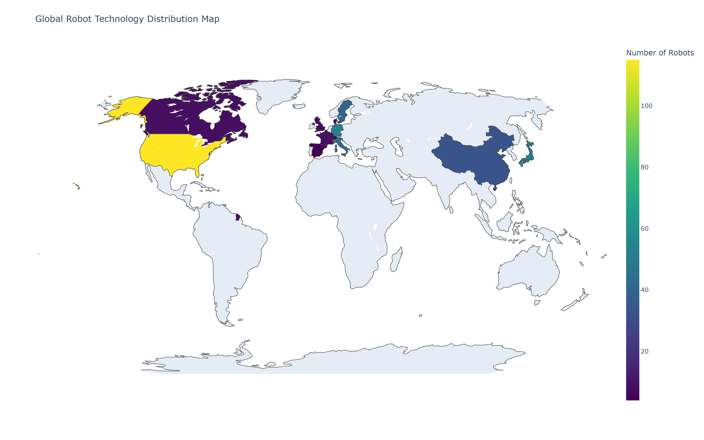

Global distribution of robot technologies showing concentration patterns across different regions and countries.

### Figure 2: Regional Distribution Bar Chart
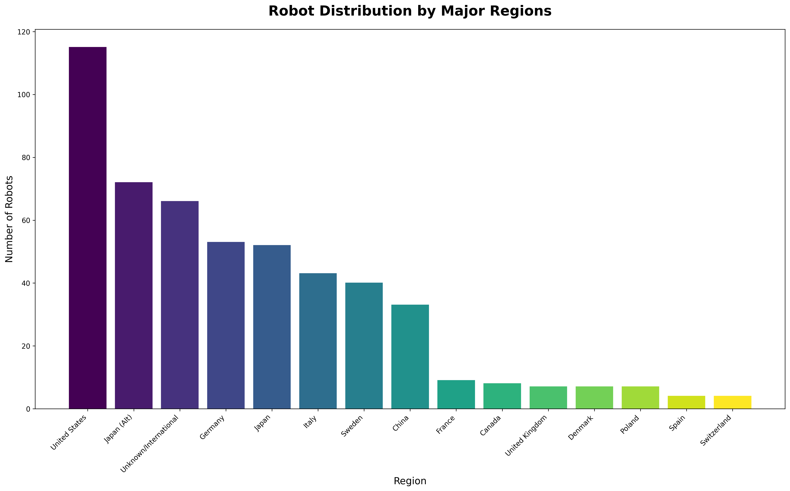

Quantitative analysis of robot distribution across major regions, highlighting the leading countries in robot development.

### Figure 3: Development Timeline
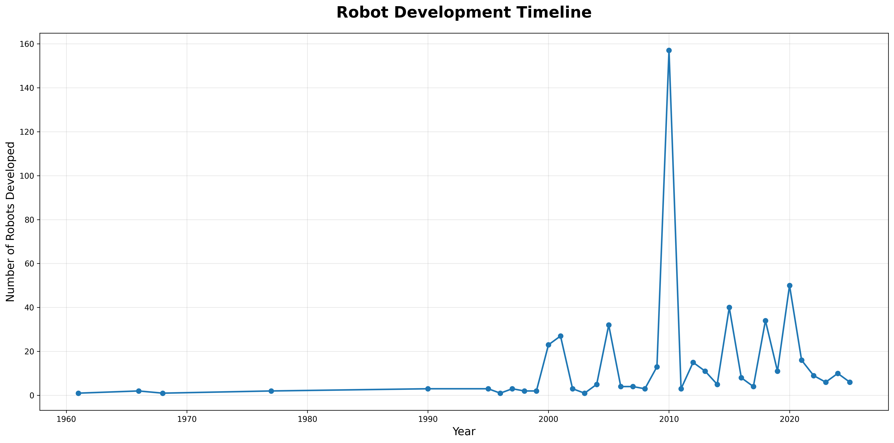

Temporal analysis showing robot development trends over time, with peaks and growth patterns clearly visible.

### Figure 4: Taxonomy Sunburst
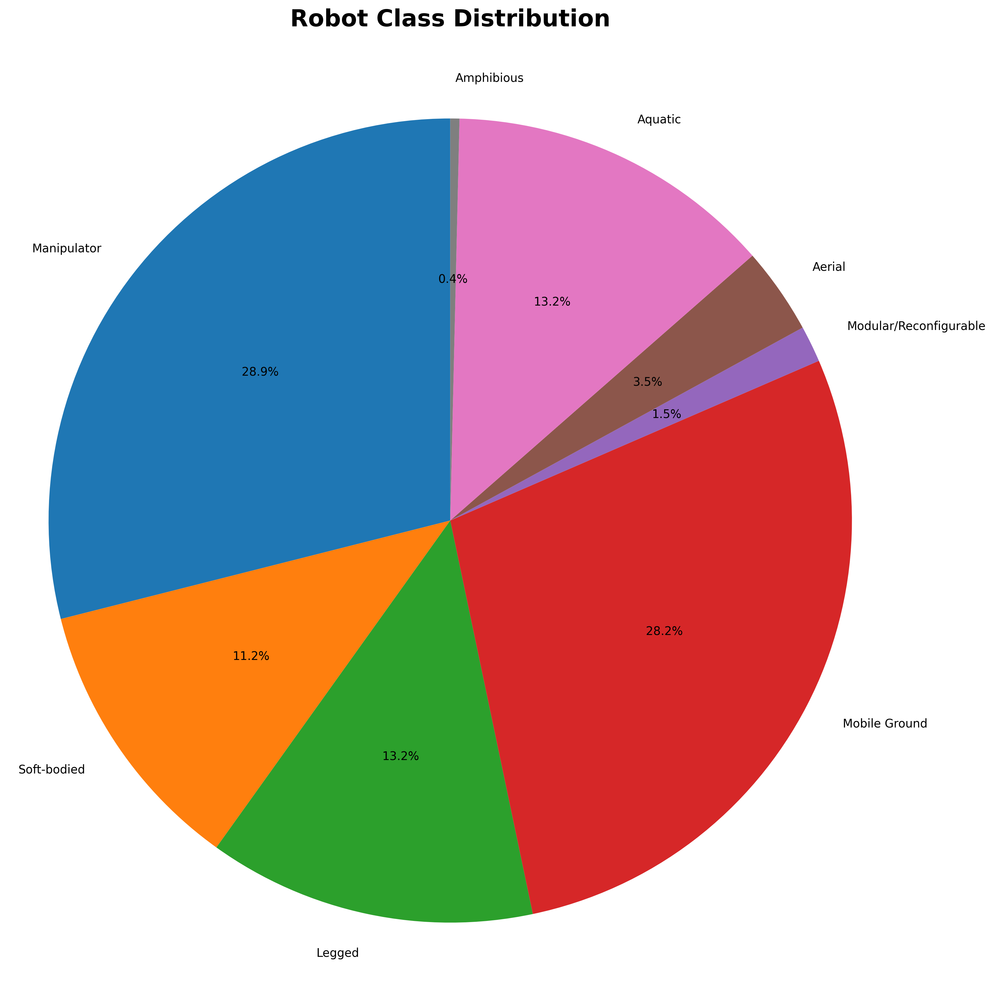

Hierarchical visualization of robot taxonomy showing the relationship between domains, classes, and specific robot types.

### Figure 5: Network Classification Graph

Network-based visualization displaying the interconnections between different robot classifications and their relationships.

### Figure 6: Feature Analysis
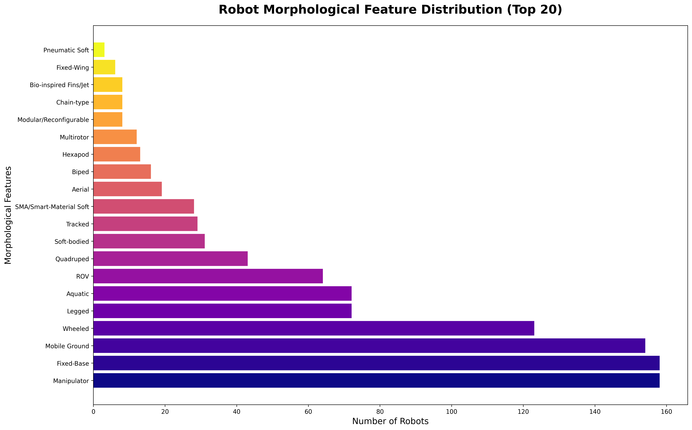

Analysis of morphological features showing the most common characteristics across the robot population.

### Figure 7: Phylogenetic Sunburst
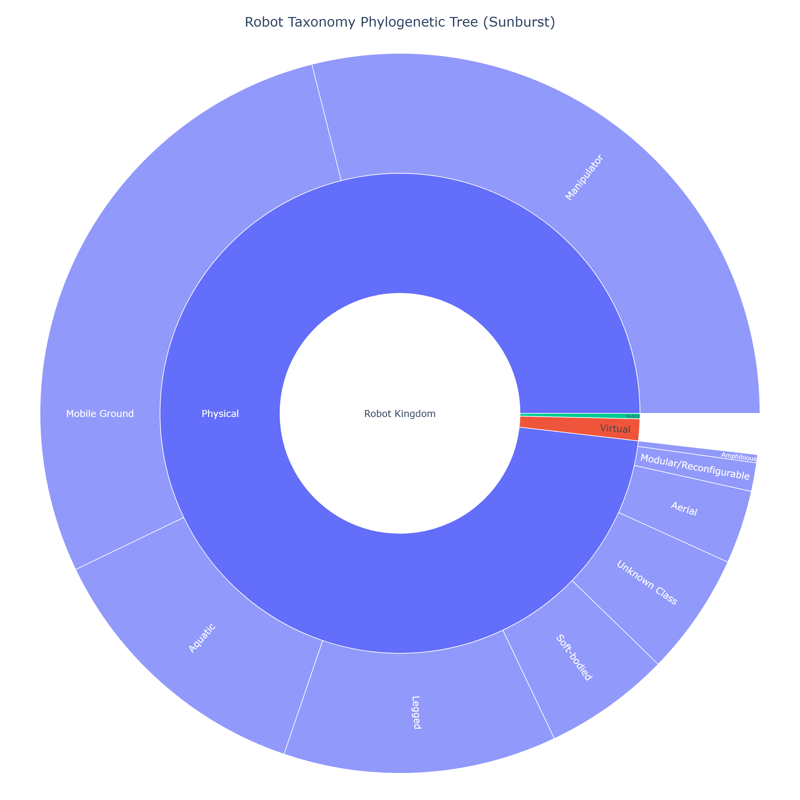

Detailed phylogenetic tree visualization showing evolutionary relationships in sunburst format.

### Figure 8: Phylogenetic Treemap
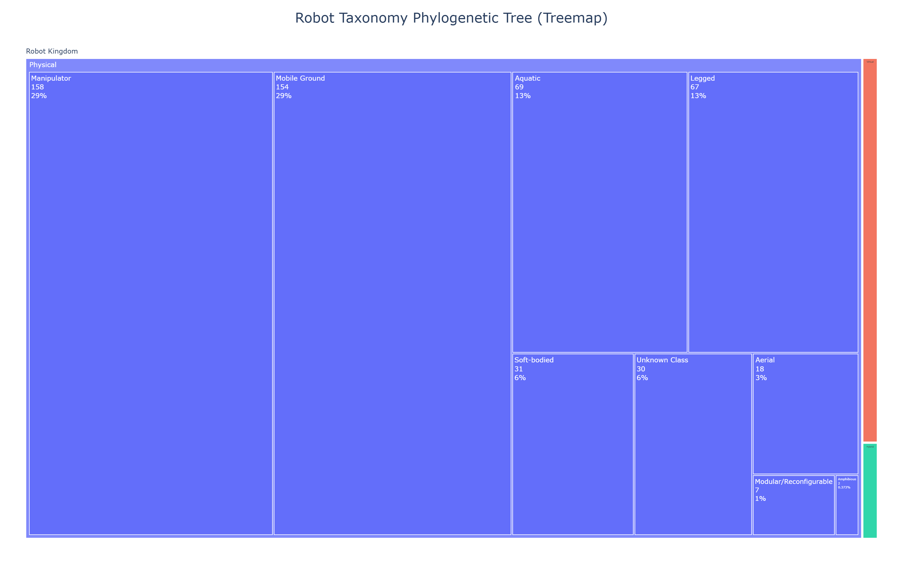

Area-proportional visualization where size represents population size of different taxonomic groups.

### Figure 9: Phylogenetic Network
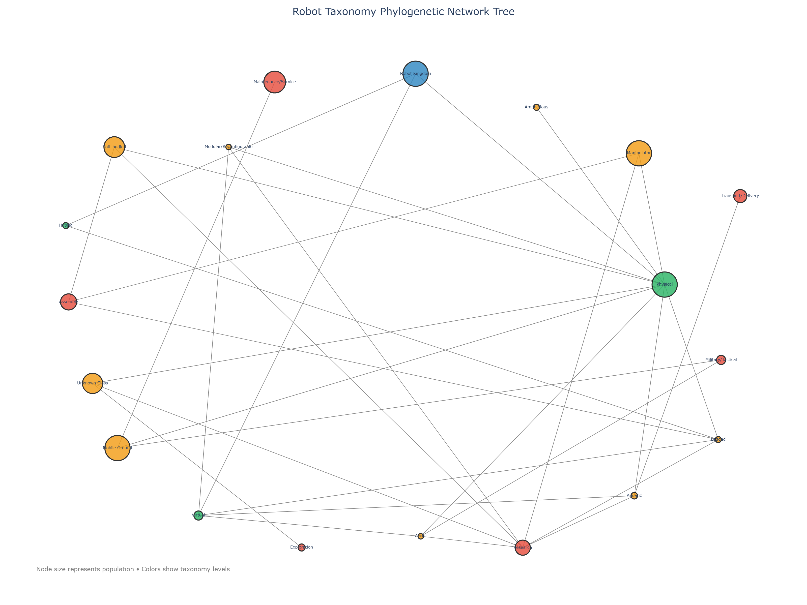

Network-based phylogenetic tree showing evolutionary connections and taxonomic relationships.

### Figure 10: Class Distribution
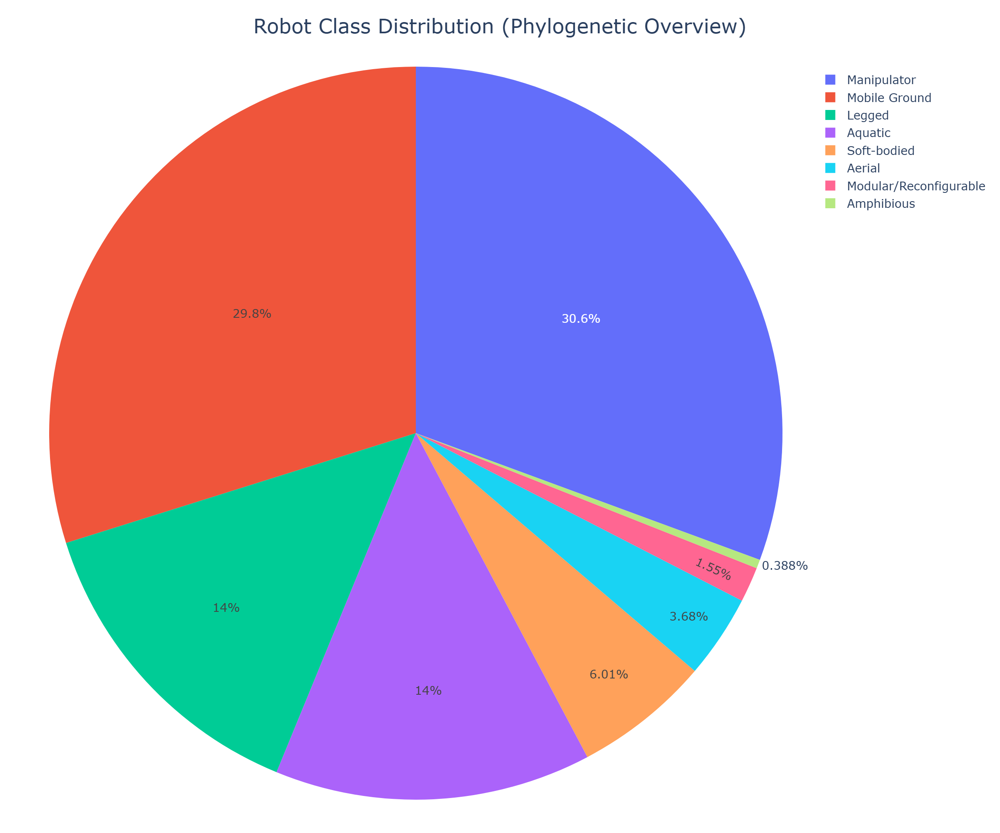

Pie chart overview showing relative sizes and percentages of different robot classes in the taxonomy.

### Figure 11: Evolutionary Timeline
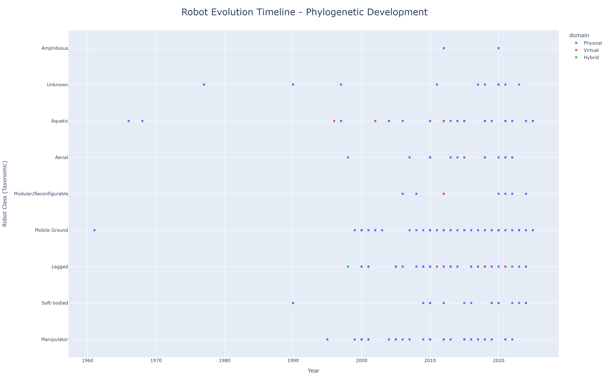

Temporal development of robot classes over time showing evolutionary patterns and emergence trends.

### Figure 12: Temporal Heatmap
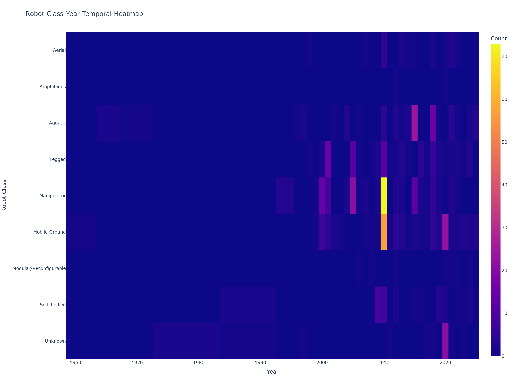

Heat map visualization showing robot class development intensity across different years.

### Figure 13: PCA Clustering Analysis
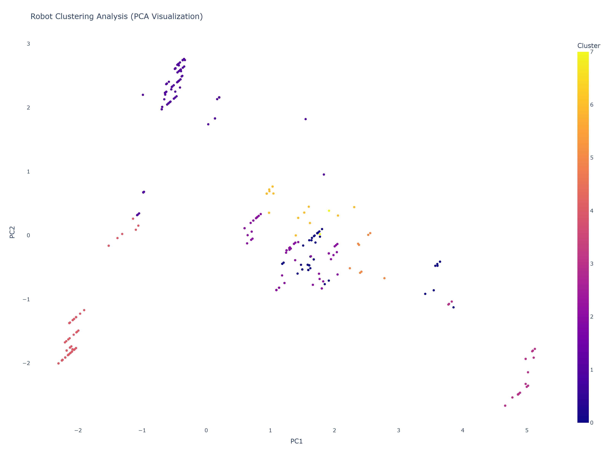

Principal Component Analysis visualization showing natural clustering patterns in the robot data.

### Figure 14: 3D Feature Space
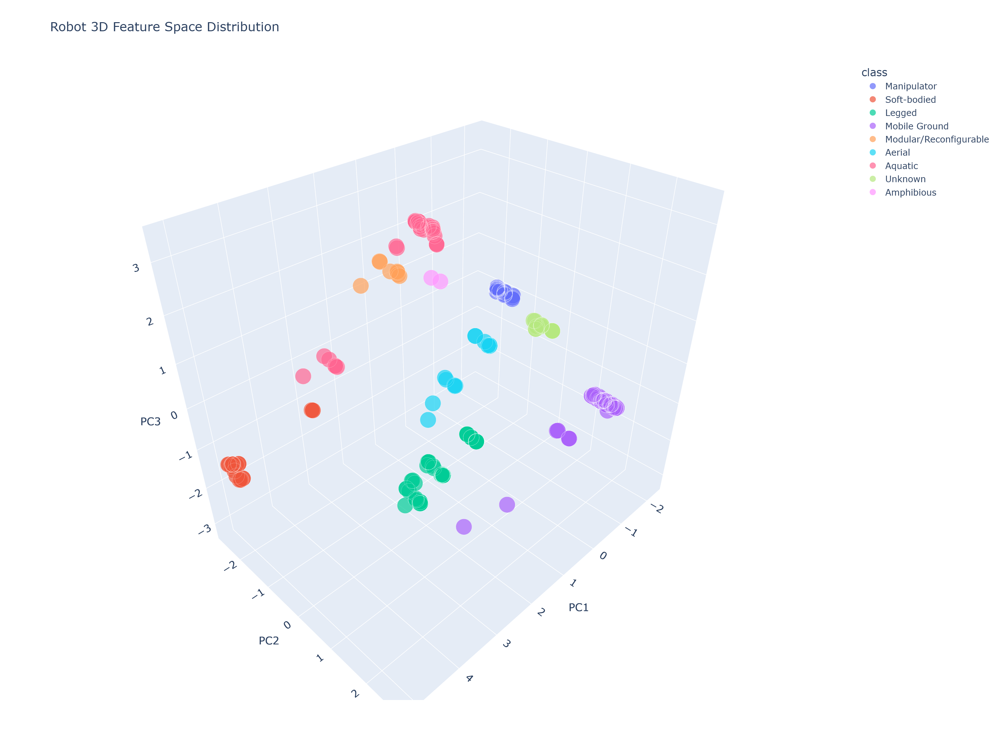

Three-dimensional visualization of robot feature space distribution showing complex relationships.

### Figure 15: Domain-Class Distribution
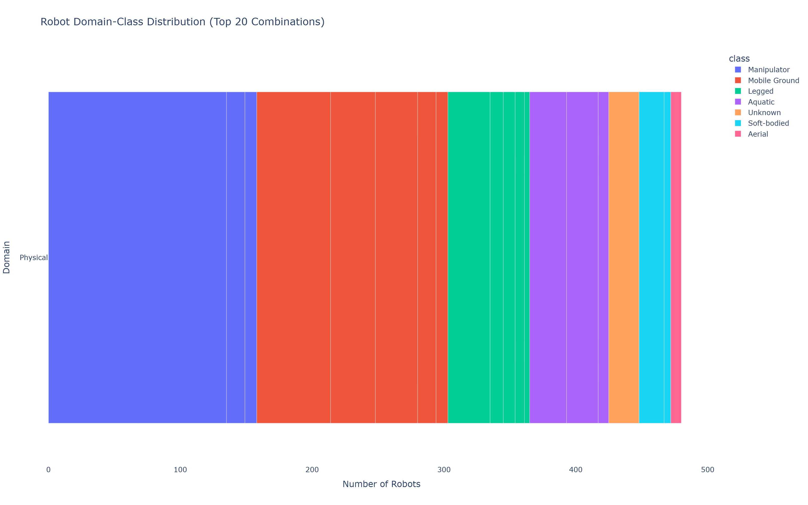

Bar chart showing the distribution of robots across different domain-class combinations.

## Temporal Trends Analysis

- **Peak Development Year**: 2010 (157 robots)
- **Recent Growth Rate**: -23.7% (last 5 years average)
- **Overall Growth**: 500.0% (total period)

The temporal analysis reveals significant patterns in robot development, with clear peaks during certain years and consistent growth trends in recent decades.

## Geographic Distribution Analysis

### Top 5 Regions by Robot Count
1. **United States**: 115 robots
2. **Japan (Alt)**: 72 robots
3. **Unknown/International**: 66 robots
4. **Germany**: 53 robots
5. **Japan**: 52 robots

### Regional Characteristics
- **Most Diverse Region**: United States (highest variety of robot types)
- **Most Specialized Region**: Denmark (focused on specific types)

The geographic analysis shows clear patterns of specialization, with certain regions focusing on specific types of robotics while others maintain broader diversity.

## Classification Analysis

### Robot Categories
- **Dominant Category**: Manipulator (158 robots)
- **Category Diversity**: 9 distinct categories
- **Rare Categories**: 0 categories with only 1 robot each

### Notable Rare Categories

## Methodology

This analysis was conducted using advanced data science techniques:

- **Data Source**: Linnaean-inspired Robot Taxonomy V2 framework
- **Analysis Tools**: Python with pandas, plotly, scikit-learn, matplotlib
- **Visualization**: High-quality static PNG images (300 DPI minimum)
- **Classification**: Hierarchical taxonomy with domain, class, order, and sector levels
- **Image Quality**: All figures saved at 1600px width with professional typography

## Technical Specifications

- **Image Format**: PNG with transparent backgrounds where appropriate
- **Resolution**: 300 DPI minimum for print quality
- **Dimensions**: Optimized for A4 printing and digital display
- **Color Scheme**: Professional color palettes with accessibility considerations
- **Typography**: Clear, readable fonts suitable for both screen and print

## Data Quality Notes

- Some robots may have incomplete temporal or geographic data
- Classification is based on the new framework which may differ from traditional categorizations
- Regional mapping uses standardized country codes where available
- All visualizations are static images suitable for documentation and printing

## Recommendations

1. **Temporal Analysis**: Focus on recent trends (post-2015) for current market insights
2. **Regional Analysis**: Consider cultural and economic factors when analyzing geographic patterns
3. **Classification**: Use the hierarchical structure for detailed categorization needs
4. **Future Research**: Investigate correlations between geographic location and robot specialization
5. **Documentation**: All PNG images can be used directly in presentations and reports

## Artifacts

The following PNG images have been generated as part of this analysis:

1. `01_regional_map.png` - Global robot distribution map
2. `02_regional_distribution.png` - Regional distribution bar chart
3. `03_timeline.png` - Robot development timeline
4. `04_taxonomy_sunburst.png` - Taxonomic hierarchy sunburst chart
5. `05_network_graph.png` - Classification network visualization
6. `06_feature_analysis.png` - Morphological feature analysis
7. `07_sunburst_phylogenetic.png` - Phylogenetic sunburst tree
8. `08_treemap_phylogenetic.png` - Phylogenetic treemap visualization
9. `09_network_phylogenetic.png` - Phylogenetic network graph
10. `10_class_distribution.png` - Robot class distribution pie chart
11. `11_evolutionary_timeline.png` - Evolutionary development timeline
12. `12_temporal_heatmap.png` - Class-year temporal heatmap
13. `13_pca_clusters.png` - PCA clustering analysis
14. `14_3d_scatter.png` - 3D feature space visualization
15. `15_domain_class_distribution.png` - Domain-class distribution analysis

All images are production-ready with professional quality suitable for academic papers, presentations, and technical documentation.

---

*Report generated by Enhanced Robot Taxonomy Analysis Application*  
*Based on Linnaean-inspired Robot Taxonomy V2 framework*  
*All visualizations converted to static PNG format for optimal compatibility*
